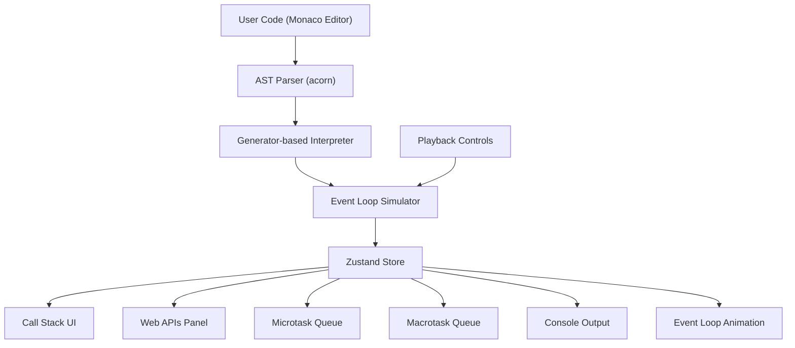

# JavaScript Event Loop Visualizer — Implementation Plan

## Tech Stack

- **Build tool:** Vite + React 18 + TypeScript
- **Routing:** React Router v6
- **Styling:** TailwindCSS (dark theme, glassmorphism utilities)
- **Animations:** Framer Motion
- **Code Editor:** `@monaco-editor/react`
- **State:** Zustand
- **Parser:** `acorn` + `acorn-walk` (AST parsing)
- **Utilities:** `clsx`, `tailwind-merge`

No backend needed — all simulation logic runs client-side.

---

## Architecture Overview




---

## Project Structure

```
src/
├── main.tsx, App.tsx, index.css
├── components/
│   ├── layout/        — Navbar, Footer, PageLayout
│   ├── ui/            — GlassCard, Button, Badge, AnimatedBackground
│   ├── landing/       — HeroSection, HeroAnimation
│   ├── visualizer/    — CallStack, WebAPIs, Queues, EventLoop, Console, Editor, Controls
│   └── educational/   — AnimatedDiagram, CodeExample, InteractiveDemo
├── engine/
│   ├── types.ts       — All type definitions (ExecutionStep, StackFrame, Task, etc.)
│   ├── parser.ts      — acorn AST parsing + validation
│   ├── interpreter.ts — Generator-based tree-walking interpreter
│   ├── environment.ts — Scope chain and variable management
│   ├── eventLoop.ts   — Full event loop simulation (microtask/macrotask scheduling)
│   ├── builtins.ts    — Built-in APIs (console, setTimeout, Promise, async/await, etc.)
│   └── examples.ts    — Prebuilt code examples
├── store/
│   └── visualizerStore.ts — Zustand: call stack, queues, console, playback state
├── pages/             — HomePage, AboutRuntimePage, EventLoopPage, NodeVsBrowserPage, ExamplesPage, VisualizerPage
├── hooks/             — useEngine, usePlayback
└── lib/utils.ts       — cn() helper, misc utilities
```

---

## Phase 1: Project Scaffolding

- Initialize Vite + React + TS project
- Install all dependencies:
`react-router-dom`, `tailwindcss`, `@tailwindcss/vite`, `framer-motion`, `@monaco-editor/react`, `zustand`, `acorn`, `acorn-walk`, `clsx`, `tailwind-merge`
- Configure Tailwind with dark theme defaults (charcoal/navy palette), glassmorphism utilities
- Set up React Router with all 6 routes
- Create Layout shell (Navbar + Footer + `<Outlet />`)

---

## Phase 2: Design System and Shared Components

Build reusable UI primitives with the premium dark aesthetic:

- **GlassCard** — backdrop-blur, subtle border, soft shadow (the core panel component)
- **Button** — primary (neon accent glow), secondary, ghost variants
- **Badge** — status indicators for queue items
- **AnimatedBackground** — subtle floating particles or grid pattern for hero/pages
- **Navbar** — glass-style sticky nav with route links, logo
- **Footer** — minimal footer with links
- **PageLayout** — consistent page wrapper with max-width, padding, fade-in animation

Design tokens (Tailwind config):

- Background: `#0a0e1a` (deep navy), `#111827` (charcoal)
- Surface: `rgba(255,255,255,0.05)` glass panels
- Accent: `#3b82f6` (blue), `#8b5cf6` (purple), `#10b981` (green)
- Neon glow: box-shadow utilities for active elements
- Font: Inter or JetBrains Mono for code

---

## Phase 3: Landing Page

`[src/pages/HomePage.tsx]`

- **Hero section**: Large title + subtitle, animated JS runtime diagram in background (floating stack frames, queue items using Framer Motion)
- **Feature cards**: 3-4 GlassCards highlighting key features
- **CTA button**: "Let's Visualize" linking to `/visualizer`
- Nav links to educational pages
- Subtle scroll animations (fade-in on viewport entry)

---

## Phase 4: Educational Pages (4 pages)

Each page follows a consistent template: hero header, content sections with animated diagrams, interactive mini-demos.

**Page 1 — About JS Runtime** `[src/pages/AboutRuntimePage.tsx]`

- Animated diagram: Memory Heap + Call Stack
- Interactive demo: click to push/pop stack frames
- Explains single-threaded model, execution contexts

**Page 2 — Event Loop Deep Dive** `[src/pages/EventLoopPage.tsx]`

- Animated event loop cycle diagram
- Microtask vs macrotask priority visualization
- Rendering phase explanation
- Mini interactive: drag tasks to correct queue

**Page 3 — Node vs Browser** `[src/pages/NodeVsBrowserPage.tsx]`

- Side-by-side comparison panels
- Node phases diagram (timers, I/O, idle, poll, check, close)
- Browser: requestAnimationFrame timing
- process.nextTick vs queueMicrotask explanation

**Page 4 — Execution Examples** `[src/pages/ExamplesPage.tsx]`

- 5-6 code snippets with "Predict the Output" format
- Expandable step-by-step explanation
- Link to visualizer with that example pre-loaded

---

## Phase 5: Execution Engine (Core)

This is the heart of the application. A **generator-based tree-walking interpreter** that yields `ExecutionStep` objects.

### 5a. Type Definitions `[src/engine/types.ts]`

```typescript
type ExecutionStep = {
  type: 'PUSH_STACK' | 'POP_STACK' | 'SCHEDULE_MACROTASK' | 'SCHEDULE_MICROTASK'
       | 'REGISTER_WEB_API' | 'RESOLVE_WEB_API' | 'CONSOLE_LOG'
       | 'EVENT_LOOP_CHECK' | 'EXECUTE_MICROTASK' | 'EXECUTE_MACROTASK'
       | 'HIGHLIGHT_LINE';
  payload: Record<string, any>;
  line?: number;
  column?: number;
};

type StackFrame = { id: string; name: string; line: number; };
type Task = { id: string; label: string; callback: GeneratorFunction; type: 'micro' | 'macro'; source: string; };
type WebAPIEntry = { id: string; label: string; delay: number; remaining: number; };
type RuntimeMode = 'browser' | 'node';
```

### 5b. Parser `[src/engine/parser.ts]`

- Use `acorn` with `ecmaVersion: 2022`, `sourceType: 'module'`
- Parse user code into ESTree-compliant AST
- Validate and return parse errors to UI

### 5c. Environment `[src/engine/environment.ts]`

- Lexical scope chain (linked list of scope records)
- Variable declaration (let/const/var with proper scoping)
- Function closures (capture environment at definition)
- `this` binding support

### 5d. Interpreter `[src/engine/interpreter.ts]`

Generator-based interpreter that `yield`s `ExecutionStep` at each meaningful point:

```typescript
function* interpretNode(node: ESTree.Node, env: Environment): Generator<ExecutionStep, RuntimeValue> {
  switch (node.type) {
    case 'CallExpression':
      yield { type: 'PUSH_STACK', payload: { name: getFnName(node) }, line: node.loc.start.line };
      const result = yield* executeCall(node, env);
      yield { type: 'POP_STACK', payload: { name: getFnName(node) } };
      return result;
    case 'AwaitExpression':
      // Suspend current async function, schedule continuation as microtask
      ...
  }
}
```

Key interpreter capabilities:

- **Synchronous code**: Variables, assignments, operators, if/else, for/while, function declarations/calls
- **setTimeout / setInterval**: Register in Web APIs, schedule callback to macrotask queue after delay
- **Promise**: Constructor runs executor synchronously, `.then()` / `.catch()` schedule microtasks
- **async/await**: Transform into promise-based execution, `await` yields control
- **console.log**: Capture arguments, yield CONSOLE_LOG step
- **process.nextTick**: Schedule to microtask queue (Node mode, higher priority)
- **queueMicrotask**: Schedule to microtask queue
- **requestAnimationFrame**: Schedule as macrotask (Browser mode)
- **setImmediate**: Schedule as macrotask in check phase (Node mode)

### 5e. Event Loop Simulator `[src/engine/eventLoop.ts]`

Orchestrates the full event loop algorithm:

1. Execute global synchronous code (call stack)
2. When call stack empties:
  a. Flush ALL microtasks (including ones added during flushing)
   b. Pick ONE macrotask from queue, execute it
   c. Flush ALL microtasks again
   d. Repeat until all queues empty
3. In Node mode: respect phase ordering (timers -> I/O -> check)
4. Each transition yields steps so the visualizer can animate

### 5f. Built-ins `[src/engine/builtins.ts]`

Factory function that creates the global environment with:

- `console.log`, `console.warn`, `console.error`
- `setTimeout`, `setInterval`, `clearTimeout`, `clearInterval`
- `Promise` (constructor + static methods: resolve, reject, all, race)
- `queueMicrotask`
- `requestAnimationFrame` (browser mode)
- `process.nextTick` (node mode)
- `setImmediate` (node mode)
- Basic globals: `undefined`, `null`, `NaN`, `Infinity`, `Math` (partial)

### 5f. Prebuilt Examples `[src/engine/examples.ts]`

8-10 curated examples covering: basic sync, setTimeout ordering, Promise chains, async/await, microtask vs macrotask race, process.nextTick priority, mixed scenarios.

---

## Phase 6: Zustand Store

`[src/store/visualizerStore.ts]`

Manages all visualizer state:

- `callStack: StackFrame[]`
- `webAPIs: WebAPIEntry[]`
- `microtaskQueue: Task[]`
- `macrotaskQueue: Task[]`
- `consoleOutput: ConsoleEntry[]`
- `currentLine: number | null` (for code highlighting)
- `mode: 'browser' | 'node'`
- `playbackState: 'idle' | 'playing' | 'paused' | 'stepping' | 'finished'`
- `speed: number` (ms per step)
- `steps: ExecutionStep[]` (full step history)
- `stepIndex: number`
- Actions: `loadCode`, `step`, `play`, `pause`, `reset`, `setSpeed`, `setMode`

---

## Phase 7: Visualizer Page

`[src/pages/VisualizerPage.tsx]` — The main interactive environment.

### Layout (CSS Grid)

```
┌─────────────────────────────────────────────────┐
│  Code Editor (Monaco)  │     Call Stack          │
│  + Example Dropdown    │     (vertical stack)    │
│  + Mode Toggle         │                         │
├────────────────────────┼─────────┬───────────────┤
│  Console Output        │ Web APIs│ Event Loop    │
│                        │  Panel  │  Animation    │
├────────────────────────┼─────────┴───────────────┤
│  Playback Controls     │ Microtask │ Macrotask   │
│  (play/step/reset/speed)│  Queue   │   Queue     │
└─────────────────────────┴──────────┴─────────────┘
```

### Visual Components

- **CallStack** — Vertical stack with Framer Motion `AnimatePresence`; frames slide in from top, glow when active
- **WebAPIsPanel** — List of active timers/fetches with countdown progress bars
- **MicrotaskQueue** — Horizontal queue, items animate in from right, pop from left with glow
- **MacrotaskQueue** — Same layout, different accent color
- **EventLoopIndicator** — Animated circular/arc indicator showing current phase; arrow rotates to show which queue is being checked
- **ConsoleOutput** — Terminal-style panel with timestamped output, syntax coloring
- **CodeEditor** — Monaco with dark theme, current-line highlighting (yellow glow on executing line), examples dropdown above
- **Controls** — Play/Pause, Step Forward, Reset, Speed slider (0.5x to 3x), Node/Browser mode toggle

### Animation Strategy

All queue/stack transitions use Framer Motion:

- `layout` prop for smooth reordering
- `AnimatePresence` for enter/exit
- Spring physics for natural feel
- Neon glow pulse on active items (CSS box-shadow animation)
- Animated arrows/lines between components showing data flow (SVG paths with `motion.path`)

---

## Phase 8: Integration and Polish

- Wire engine output to Zustand store
- Connect playback controls to engine stepper
- Line highlighting in Monaco synced with execution
- Responsive layout (stack vertically on smaller screens)
- Error handling: parse errors shown inline in editor
- Loading states and transitions between pages
- Keyboard shortcuts (Space = play/pause, Right arrow = step)
- Accessibility: aria labels, focus management

---

## Key Technical Decisions


| Decision    | Choice                      | Rationale                                          |
| ----------- | --------------------------- | -------------------------------------------------- |
| Framework   | Vite + React (not Next.js)  | Pure SPA, no SSR needed, faster DX                 |
| Interpreter | Generator-based tree-walker | Naturally pausable, yields steps for visualization |
| Parser      | acorn                       | Lightweight, ESTree-compliant, battle-tested       |
| State       | Zustand                     | Minimal boilerplate, perfect for this scale        |
| Animations  | Framer Motion               | Best React animation library, layout animations    |


---

## Execution Order

The phases should be built in order (1 through 8) as each depends on the previous. Phase 5 (Engine) and Phases 3-4 (Pages) can be partially parallelized since they're independent, but the engine must be complete before Phase 7 (Visualizer Page) integration.